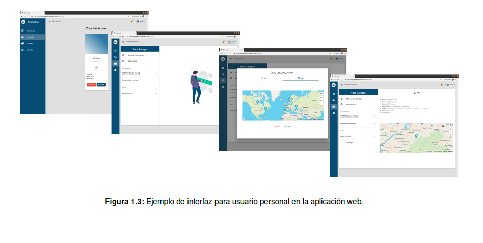

# Resumen
En este Trabajo Fin de Grado se va a desarrollar un **sistema encargado del control y administración 
de una red de garajes inteligentes y automatizados**. Para ello, el sistema estará **conformado
por dos subsistemas**. Estos subsistemas son considerados independientes y deben funcionar de manera
auto suficiente, compartiendo exclusivamente la información necesaria para dotar al sistema del
objetivo inicial.

El primero de ellos consiste en el **reconocimiento automático de matrículas**. Es un método que
deriva del campo de la visión artificial y está basado en la adquisición, procesamiento y análisis de las
imágenes extraídas del mundo real para lograr su interpretación y comprensión. Para su desarrollo se
ha hecho uso de un software opensource denominado OpenCV. El cual no solo proporciona métodos
para el procesamiento y análisis de imágenes sino que también incorpora métodos para reconocimiento
de objetos, entre otros. Con todo ello, se desarrolla un software en Python que comprende todas
las fases necesarias para la obtención de la matrícula de un vehículo a partir de su imagen frontal o
trasera.

El segundo subsistema consiste en el **desarrollo de una aplicación web**. Esta tiene como propósito
servir como red social donde los usuarios puedan gestionar tanto sus garajes como las plazas
de los mismos. Existen dos tipos de roles: usuario administrador y usuario personal. Cada uno de ellos
dispone de una interfaz exclusiva que les permite la realización de acciones específicas en función de
su rol. Por ejemplo, los usuarios personales podrán poner en alquiler sus plazas de garaje, mientras
que los usuarios administradores tienen un histórico de los vehículos que han pasado por el garaje.
Su desarrollo está basado en el uso del framework Vue, el cual permite la creación de aplicaciones
web basadas en la arquitectura SPA (Single Page Application). Por otro lado, se integran algunos de
los servicios que aporta la plataforma para el desarrollo de aplicaciones denominada Firebase.

La **integración de estos dos subsistemas** permite la obtención de un sistema capaz de controlar
los accesos a los garajes, basado en la extracción de las matrículas por medio del software de
reconocimiento de las mismas y por los datos ingresados por los usuarios en la aplicación web.

# 1. Objetivos
En este TFG se plantean **dos objetivos**. Aunque ambos se consideren sistemas independientes y
deban funcionar auto suficientemente, deben compartir información para lograr dotar de inteligencia y
automatización a la red de garajes.
**El primero** de ellos es el desarrollo de un programa en Python para el **reconocimiento de matrículas
de vehículos**. Partiendo desde una foto de un vehículo, se deberá obtener como salida su
matrícula, como se puede observar en la figura 1.1. Para ello es necesario realizar una serie de procedimientos:

1. Acotar la región de interés, que en este caso es la matrícula.
2. Segmentación de los caracteres extraídos de la zona de interés.
3. Reconocimiento de caracteres.

El propósito no solo será integrar un software que incorpore técnicas capaces de realizar dichos
pasos, sino también desarrollar métodos propios capaces de ello en base al estudio de técnicas ya
existentes. Para ambos propósitos, se hará uso de la librería de visión artificial OpenCV, que aparte
de incorporar procedimientos para el tratamiento y análisis de imágenes también posee técnicas
avanzadas para los pasos citados anteriormente.

  

**El segundo** es el desarrollo de una aplicación web. El propósito es la **creación de una red social
donde los usuarios puedan gestionar tanto sus garajes como sus plazas**. Se plantea que la
aplicación sea sencilla de utilizar e intuitiva.
Dentro de la red social existen dos roles: usuario administrador y usuario personal. Cada uno de ellos
dispone de una interfaz distinta que les permite realizar acciones específicas en función de su rol.

***El usuario administrador*** representa una organización (comunidad de vecinos, trabajo, universidad,
etc) la cual dispone de un garaje. Algunas de las vistas de la aplicación web relacionadas con el usuario
administrador pueden verse en la figura 1.2. Se caracterizará por:

1. Panel con el estado actual del garaje, es decir, plazas ocupadas y libres.
2. Histórico de vehículos que han entrado y salido del garaje.
3. tramitar altas y bajas de usuarios personales dentro de la organización.
4. Editar la asignación de plazas de garajes a los usuarios personales.

  

***El usuario personal*** representa una persona física. Algunas de las vistas de la aplicación web
relacionadas con el usuario personal pueden verse en la figura 1.3. Se caracterizará por:

1. Agregar, editar y borrar vehículos a su listado de vehículos. Con los cuales podrá acceder a los garajes.
2. Solicitar acceso a una organización. Se podrá realizar por medio de un mapa interactivo o por búsqueda en
una lista de organizaciones.
3. Poner en alquiler plazas en desuso para que otros usuarios personales puedan acceder a ellas.
4. Alquilar plazas de garajes de otros usuarios personales.

  

# 2. Diseño
En este apartado se exponen los aspectos más relevantes en cuanto al diseño del sistema. En la
primera sección se estudia la arquitectura que posee el sistema desde una perspectiva genérica. En
las sucesivas secciones se trata en detalle cada una de las piezas que componen dicho sistema.

### 2.1. Arquitectura del sistema
Partiendo de una descripción de alto nivel del sistema, determinamos que está conformado por tres
piezas, tal y como podemos ver en la figura 4.1:

  

 - **Sistema de reconocimiento de matrículas:** su tarea consiste en detectar la presencia de vehículos para realizar
fotografías y comenzar con el análisis de las mismas. Pasados unos segundos y con la matrícula reconocida,
se manda una petición a la base de datos para comprobar si dicha matrícula pertenece o no al garaje.
Será necesario un miniordenador (ej. Raspberry Pi) en cada puerta de garaje.
- **Aplicación web:** desarrollada mediante el framework Vue. Esta pieza es la que permite a los usuarios administradores
y personales gestionar las labores asociadas con los garajes.
Durante la fase de desarrollo, se levanta un pequeño servidor en local que alojara la aplicación web. Una vez
concluido el desarrollo, se opta por hacer la aplicación web accesible por medio del servicio de hosting que
proporciona firebase.
- **Base de datos:** dispone de dos puntos de acceso. El primero es usado por el sistema de reconocimiento de matrículas para consultar las matrículas analizadas. El segundo, usado por la aplicación web para el almacenamiento
de todos los datos necesarios para el funcionamiento de la misma. Pieza alojada en el sistema de bases
de datos de firebase que permite la sincronización de datos en tiempo real con una estructura NoSQL.

### 2.2. Arquitectura del sistema de reconocimiento de matrículas
Para crear un sistema capaz del reconocimiento de matrículas se ha hecho uso de la visión artificial.
Siendo esta una disciplina científica derivada de la inteligencia artificial que incluye métodos para
la adquisición, procesamiento, análisis y comprensión de imágenes. En definitiva, el propósito es el
diseño de sistemas informáticos capaces de extraer información de una imagen tomada del mundo
real.
En concreto, para resolver el reconocimiento de matrículas, será necesario que el sistema utilice
técnicas de procesamiento de imágenes y de reconocimiento de patrones para extraer información
sobre la matrícula presente en la imagen. Para ello es necesario aplicar cuatro fases:

1. **Captura de la imagen**: esta fase es sustituida por imágenes de vehículos extraídas de la base de datos.
2. **Localización de la matrícula**: fase considerada como la más compleja de todo el proceso de reconocimiento
de la matrículas, pues entran en juego muchos objetos en la imagen que pueden ofuscar al sistema.
Como se puede observar en la figura 4.2, la fase parte con la imagen realizada al vehículo. A continuación,
por medio de técnicas de procesamiento de imágenes se trata de extraer información útil para ubicar y acotar
la matrícula del resto de la imagen. Para ello, se utilizan técnicas que recurren a la detección de extremos,
búsqueda de coincidencias, extracción de punto de interés, etc.
Para realizar esta fase ha sido necesario el uso de la librería OpenCV, de la cual se han extraído técnicas
de reconocimiento de objetos como: Haar Cascade, Speeded-Up Robust Features (SURF) y Histogram of
Oriented Gradients (HOG) .
Por otro lado, se implementa una técnica propia llamada SelfMethod basada en las nociones aprendidas
durante la implementación de las técnicas extraídas de OpenCV.

  

3. **Segmentación de caracteres**: tras haber acotado la matrícula, se segmenta cada uno de los caracteres
presentes en la matrícula, tal y como se observa en la figura 4.3.
Es considerada una fase crucial ya que un error durante la segmentación acarrea la incomprensión de la matrícula
en la siguiente fase.
A pesar de ello, la complejidad para llevar a cabo el proceso es mínima. Por esa razón, se decidió implementar
un método propio denominado SelfMethod. Para lograr esto, se vuelven a utilizar técnicas de procesamiento de
imágenes extraídas de la librería OpenCV.
Otro aspecto a tener en cuenta durante esta fase es eliminar aquellos elementos indeseables de las matrículas
como: guiones, puntos, país de la matrícula, etc.

  

4. **Reconocimiento de caracteres**: de la fase anterior se reciben tantas imágenes como caracteres haya en
la matrícula. En cada una de las imágenes se ha de efectuar el mismo procedimiento. El primer paso es la
binarización de la imagen, esto consiste en reducir la información presente de la imagen para normalizar el
histograma y atenuar el ruido.
El siguiente paso consiste en la extracción de características para su comparación con los patrones de
caracteres ya definidos en el motor OCR . De esta manera, el resultado será el carácter con el que más
similitud tenga.
Algunas de las problemáticas que pueden surgir en esta fase están relacionadas con la calidad de la imagen.
Entre las dificultades se pueden encontrar: iluminación pobre, imágenes desenfocadas, técnicas de evasión
usadas por el propietario del vehículo, sombras, etc.
La salida que se obtiene al finalizar esta fase es la matricula formada por la unión de cada uno de los caracteres,
como se puede observar en la figura 4.4
Para realizar esta fase se va a utilizar un motor OCR previamente entrenado como pytesseract y también se
desarrolla un motor OCR propio para comparar resultados.

  

### 2.3. Arquitectura de la aplicación web
Se ha escogido la **arquitectura BaaS** como modelo para el desarrollo de la aplicación web. Esta arquitectura se basa en otorgar al desarrollador una serie de servicios que le permita prescindir de la
creación de una API personalizada.
La tecnología escogida para la implementación de dicha arquitectura es **Firebase**. Los servicios que
se han integrado en nuestra aplicación son:

- Base de datos en tiempo real: permite prescindir de tareas como el mantenimiento y la optimización de la misma. El único contra es que debes adaptarte al ecosistema que ofrece.
- Hosting: permite alojar la aplicación en sus servidores.
- Servicio de autenticación de usuarios: para el control de acceso, registro y gestión de los usuarios.

En definitiva, la **elección de la arquitectura se basa en el hecho de no tratar temas que no competen en el desarrollo de este TFG**. De esta manera, liberamos al desarrollador de carga de
trabajo en aspectos no trascendentales.
Esto da lugar a que la mayor parte del desarrollo se centre en la creación de la interfaz de usuario.
La tecnología escogida para llevar el desarrollo de la interfaz es el framework de Javascript denominado Vue. Usado para el desarrollo de páginas web siguiendo el **patrón Modelo, Vista, Vista-Modelo
(MVVM)**. La principal finalidad de este patrón es desacoplar lo máximo posible la interfaz de usuario de la lógica de la aplicación.
Este patrón está compuesto por tres partes, tal y como se puede observar en la siguiente figura 4.5:

  

# Resultados (vídeos).

### Sistema reconocimiento de matrículas.

1. Localización de matrícula (click para ver el vídeo completo):

2. Segmentación matrícula (click para ver el vídeo completo): 

2. Reconocimiento de caracteres (click para ver el vídeo completo): 

## Aplicación web.

1. Registro de usuario persona (click para ver el vídeo completo): 

2. Añadir vehículo en cuenta de usuario personal (click para ver el vídeo completo): 

3. Añadiendo organizaciones a usuario personal (click para ver el vídeo completo): 

4. Alquilando garaje (click para ver el vídeo completo): 

## Integración.

1. Accediendo al garaje (click para ver el vídeo completo): 

